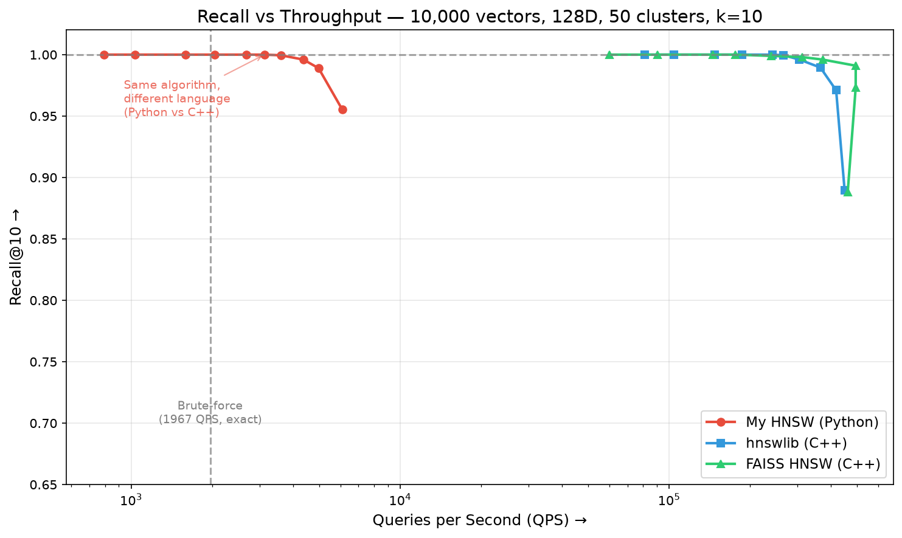

# Mini Vector Database — HNSW from Scratch

A mini, Pinecone-style vector database engine with **HNSW (Hierarchical Navigable Small World)** approximate nearest-neighbour search implemented from scratch in Python — plus a real-time animated visualization of the algorithm in action.



## 🎯 What This Is

The algorithmic search core of a vector database — the engine that stores high-dimensional vectors and quickly returns the ones nearest to a query. Built from the ground up following the [original HNSW paper](https://arxiv.org/abs/1603.09320) (Malkov & Yashunin, 2016).

**Key results:**
- **99.5% recall@10** on 10K vectors — matching hnswlib and FAISS accuracy
- ~100× throughput gap is purely Python vs C++ (not algorithmic)
- Real-time visualization showing the algorithm traverse the graph layer by layer

## 🏗️ Architecture

```
┌─────────────────────────────────────────────────────────────┐
│  Frontend (React + D3)                                       │
│  Animated graph visualization of HNSW search/insert          │
├─────────────────────────────────────────────────────────────┤
│  API Layer (FastAPI + WebSocket)                             │
│  POST /search, POST /add, GET /graph, WS streaming          │
├─────────────────────────────────────────────────────────────┤
│  Embedding Layer (sentence-transformers)                     │
│  Text → 384D vector (all-MiniLM-L6-v2, runs locally)        │
├─────────────────────────────────────────────────────────────┤
│  HNSW Index (from scratch)                                   │
│  Multi-layer graph, beam search, heuristic neighbour select  │
└─────────────────────────────────────────────────────────────┘
```

## 🚀 Quick Start

```bash
# Clone and setup
git clone https://github.com/AdityaSingh-7/mini-vecdb.git
cd mini-vecdb
python3 -m venv .venv
source .venv/bin/activate
pip install -r requirements.txt

# Build the demo index (if saved_index/ doesn't exist already)
python prepare_demo.py

# Build the frontend
cd frontend && npm install && npx vite build && cd ..

# Run
python server.py
# → Open http://localhost:8080
```

## 📊 Benchmark Results

Tested on 10,000 random vectors (128 dimensions), k=10 nearest neighbours:

| Method | Recall@10 at ~96% | QPS | Language |
|--------|-------------------|-----|----------|
| **My HNSW** | 0.961 | 491 | Python |
| hnswlib | 0.966 | 46,607 | C++ |
| FAISS HNSW | 0.966 | 78,995 | C++ |
| Brute-force | 1.000 | 2,097 | Python/numpy |

All three HNSW implementations follow the same recall-vs-speed tradeoff curve — the throughput gap is purely the cost of interpreted Python vs compiled C++ with SIMD, not an algorithmic difference.

## 🧠 How HNSW Works

### The Problem
Brute-force nearest-neighbour search compares the query against **every** stored vector — O(N) per query. At 1M vectors, this is too slow for real-time.

### The Solution
Build a layered graph and walk it greedily instead of scanning everything:

```
Layer 2:   ·       ·       ·       ← few nodes, long edges (highways)
Layer 1:   · · · · · · · ·        ← more nodes, medium edges
Layer 0:   · · · · · · · · · · ·  ← all nodes, short edges (local streets)
```

**Search:** Start at the top → greedy hop across long distances → drop layer → refine → repeat until Layer 0 finds the precise answer. Visits ~100-300 nodes instead of 1,000,000.

**Key ideas:**
- **Navigable Small World graph:** each vector links to ~M nearby neighbours; search by hopping to whichever neighbour is closest to the query
- **Hierarchy:** stacked layers — sparse top for big jumps, dense bottom for precision
- **Exponential level assignment:** `floor(-ln(random()) × 1/ln(M))` creates the pyramid naturally
- **Heuristic neighbour selection:** prefer diversity over pure closeness to prevent local minima

### Parameters
| Parameter | Controls | Typical |
|-----------|----------|---------|
| `M` | Edges per node (graph density) | 12–48 |
| `ef_construction` | Search width during build (graph quality) | 100–500 |
| `ef_search` | Search width during query (recall vs speed dial) | 10–200 |

## 🎨 Visualization

The frontend animates HNSW in real-time:
- **Yellow nodes/edges:** algorithm visiting nodes during search
- **Blue nodes:** nodes being expanded (looking at neighbours)
- **Green nodes:** final search results
- **Dashed lines:** the search path through the graph

Users can:
- **Search:** type a natural language query, watch the traversal, see results
- **Add:** paste text to insert into the index, watch edges form
- **Control speed:** slow down animation to see each step

## 📁 Project Structure

```
├── hnsw.py                  ← Core HNSW implementation (insert, query, save/load)
├── hnsw_instrumented.py     ← Event-emitting wrapper for visualization
├── brute_force.py           ← Exact search (ground truth / baseline)
├── embedder.py              ← Text → vector (sentence-transformers)
├── server.py                ← FastAPI backend (REST + WebSocket)
├── benchmark.py             ← Recall vs QPS benchmark script
├── prepare_demo.py          ← Builds the pre-loaded demo index
├── frontend/src/
│   ├── App.tsx              ← Main UI (search, add, controls)
│   └── GraphCanvas.tsx      ← SVG graph visualization + animation
└── tests/
    ├── test_brute_force.py
    ├── test_hnsw_skeleton.py
    ├── test_search_layer.py
    ├── test_insert.py
    └── test_query.py
```

## 🔧 API Endpoints

| Method | Endpoint | Description |
|--------|----------|-------------|
| POST | `/search` | Semantic search — returns results + algorithm event trace |
| POST | `/add` | Add text to index — returns insert events |
| GET | `/stats` | Index statistics (vectors, layers, M) |
| GET | `/graph` | Full graph structure for visualization |
| WS | `/ws/search` | Stream search events in real-time |
| WS | `/ws/add` | Stream insert events in real-time |

## 📈 What I Learned

1. **The level assignment formula** is elegant — one line (`floor(-ln(r) × 1/ln(M))`) creates the entire sparse-top/dense-bottom hierarchy automatically.

2. **Heuristic neighbour selection** is critical for high-dimensional data — naive "pick closest M" creates clustered edges that trap greedy search in local minima.

3. **The ef parameter** is the core insight of HNSW — same graph, same algorithm, just a wider beam. It's not a different algorithm at different ef values; it's the same beam search with a different budget.

4. **Python vs C++ matters enormously for this workload** — per-node dict lookups and heap operations in Python can't compete with cache-friendly memory layouts and SIMD in hnswlib/FAISS. The algorithm is identical; the constant factors aren't.

## 🛠️ Tech Stack

- **Core:** Python, NumPy
- **Embeddings:** sentence-transformers (all-MiniLM-L6-v2)
- **Backend:** FastAPI, uvicorn, WebSocket
- **Frontend:** React, TypeScript, D3.js, Vite
- **Benchmarked against:** hnswlib, FAISS

## License

MIT
